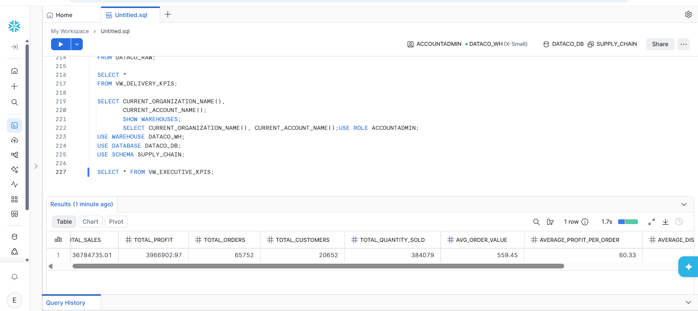

# Global Sales & Supply Chain Analytics

## Project Overview

This project presents an end-to-end analysis of global sales, profitability, customer behavior, market performance, and supply chain operations.

The solution processes **180,519 transaction records** through a complete analytics workflow using **Python, Snowflake, SQL, Power BI, and Excel**, transforming raw operational data into interactive dashboards and actionable business insights.

## Business Objectives

The project aims to:

- Analyze overall sales and profitability performance
- Identify high-performing and underperforming products and categories
- Evaluate customer and market performance
- Analyze shipping efficiency and delivery delays
- Identify high-risk orders and late-delivery patterns
- Transform analytical findings into business recommendations

## Technology Stack

| Technology | Purpose |
|---|---|
| Python / Pandas | Data cleaning and preprocessing |
| Snowflake | Cloud data warehousing |
| SQL | Data transformation, analytical views, and KPI calculations |
| Power BI | Data visualization and dashboard development |
| Excel | Initial data exploration and validation |

## Analytics Workflow

**Raw Data → Python Cleaning → Snowflake → SQL Analysis → Power BI → Business Insights**

The project follows an end-to-end analytics pipeline where raw supply chain data is cleaned using Python, loaded into Snowflake, transformed and analyzed using SQL, and visualized through Power BI dashboards.

## Dataset

- **Records:** 180,519
- **Original Dataset:** 91.4 MB
- **Cleaned Dataset:** 82.6 MB
- **Coverage:** Global sales, customers, products, markets, orders, shipping, and delivery

Due to the size of the datasets, the full original and cleaned files are hosted externally on Google Drive.

[View Original & Cleaned Datasets on Google Drive](https://drive.google.com/drive/folders/1fmbvIFBg2f4yVq1F8q2X0pm0MzfYZsjL?usp=sharing)

## Python Data Cleaning

Python and Pandas were used to prepare the raw dataset for analysis.

Key preprocessing tasks included:

- Missing-value analysis
- Duplicate detection and removal
- Data type validation
- Date and timestamp processing
- Removal of unnecessary fields
- Creation of analysis-ready features
- Export of the cleaned dataset for Snowflake ingestion

The complete cleaning script is available in the [`python`](python/) directory.

## Snowflake Data Warehouse

Snowflake was used as the cloud data warehouse for storing and transforming the cleaned dataset.

The implementation includes:

- Warehouse configuration
- Database and schema creation
- Stage and file-format configuration
- Bulk data loading
- Analytical SQL views
- KPI calculations and aggregations

The complete Snowflake SQL workflow is available in the [`sql`](sql/) directory.

## Power BI Dashboards

Five Power BI dashboard pages were developed to transform analytical results into business insights.

### 1. Global Supply Chain Performance Dashboard

Provides an executive-level view of overall business performance across sales, profitability, orders, customers, products, markets, and delivery operations.

### 2. Sales & Profit Analysis Dashboard

Examines sales and profitability across categories, products, and markets to identify major revenue contributors and areas of weak profitability.

### 3. Customer & Market Performance Dashboard

Analyzes customer segments, customer value, geographic performance, and market contribution to understand where business demand is concentrated.

### 4. Supply Chain & Delivery Analytics Dashboard

Evaluates shipping modes, late deliveries, shipping delays, and delivery risk to identify operational bottlenecks within the supply chain.

### 5. Key Insights & Strategic Recommendations Dashboard

Consolidates the major analytical findings and translates them into strategic recommendations for improving profitability, customer performance, and delivery efficiency.

## Key Business Metrics

The analysis produced several executive-level KPIs, including:

- **Total Sales:** $36.78M
- **Total Profit:** $3.97M
- **Profit Margin:** 10.78%
- **Average Order Value:** $559.45
- **Late Delivery Rate:** 54.82%
- **On-Time Delivery Rate:** 17.83%
- **Average Shipping Delay:** 0.57 days
- **Average Actual Shipping Time:** 3.50 days

## Repository Structure

    Global-Sales-Supply-Chain-Analytics/
    │
    ├── assets/
    │   ├── project_cover.png
    │   └── README.md
    │
    ├── dashboard/
    │   ├── 01 Global Supply Chain Performance Dashboard.jpg
    │   ├── 02 Sales & Profit Analysis Dashboard.jpg
    │   ├── 03 Customer & Market Performance Dashboard.jpg
    │   ├── 04 Supply Chain & Delivery Analytics Dashboard.jpg
    │   ├── 05 Key Insights & Strategic Recommendations Dashboard.jpg
    │   └── README.md
    │
    ├── data/
    │   └── README.md
    │
    ├── powerbi/
    │   ├── Global_Sales_Supply_Chain_Analytics.pbix
    │   ├── Global_Sales_Supply_Chain_Analytics.pdf
    │   └── README.md
    │
    ├── python/
    │   ├── data_cleaning.py
    │   └── README.md
    │
    ├── snowflake/
    │   ├── snowflake_query_execution.png
    │   └── README.md
    │
    ├── sql/
    │   ├── 00_setup.sql
    │   ├── 01_load data.sql
    │   ├── 1_executive_analysis.sql
    │   ├── 2_sales_profit_analysis.sql
    │   ├── 3_customer_market_analysis.sql
    │   ├── 4_supply_chain_delivery_analysis.sql
    │   └── README.md
    │
    └── README.md

## Power BI Report

The complete Power BI project (`.pbix`) and exported PDF report are available in the [`powerbi`](powerbi/) directory.

The individual dashboard pages are also available in the [`dashboard`](dashboard/) directory for quick viewing.

## Project Outcome

This project demonstrates an end-to-end analytics workflow covering **data cleaning, cloud data warehousing, SQL analysis, data visualization, dashboard development, KPI validation, and business insight generation**.

The project converts raw operational data into structured analytical outputs and business-focused dashboards that support decision-making across **sales, profitability, customer performance, market performance, and supply chain operations**.
